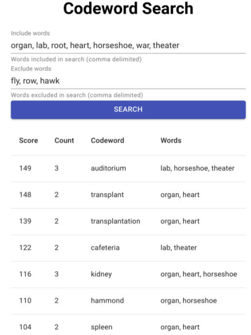

# codewords-helper

A helper tool for the codewords game that can help the spymaster come up with 
clues.



Required environment variables:

- WORDASSOCIATIONS_NET_API_KEY:  Key for 
  [wordassociations.net](http://wordassociations.net) API

## Getting started

Head over to the [Word Associations API page](https://wordassociations.net/en/api)
and follow the instructions to get an API key 
([subscription page]([https://api.wordassociations.net/subscriptions/))

Create a .env file with the API Key

```env
WORDASSOCIATIONS_NET_API_KEY=<API KEY>
```

Then run the app

```sh
yarn && yarn start
```
